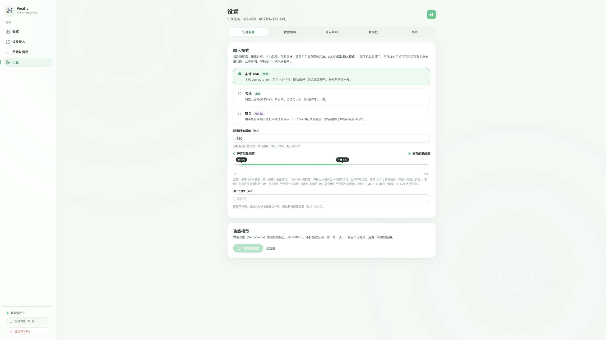
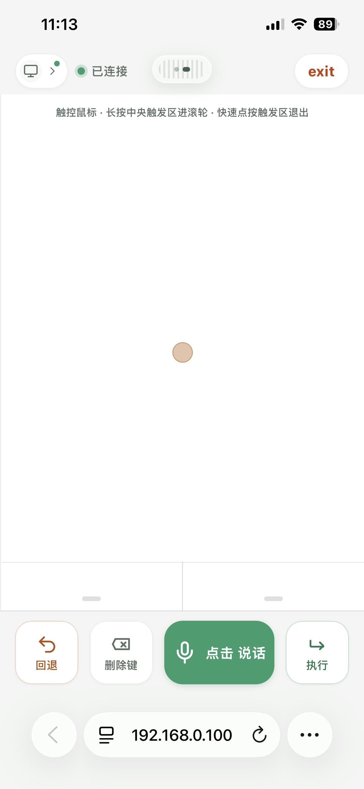

# Vocifly

一款为轻交互而做的产品。

## 产品理念

### 背景

上一个时代，机器只听得懂精确的指令。于是我们向机器学习——背快捷键、记命令参数，用熟练的手指换取机器的回应。这种"强交互"代价高昂：每一次操作，都要先在心里把模糊的想法翻译成一套精确的键盘与鼠标指令；键盘、鼠标与端正的坐姿，成了我们和电脑打交道时的必需品。人真正想做的事——把想法说出来——反而要先学会一套机器的语言。

### 愿景

我们相信，交互的下一步是"轻交互"。二八法则在这里同样成立：真正用得上的指令，永远只有 20%，剩下 80% 的琐碎操作，本不该占用你的注意力。Vocifly 想做的，就是把这 20% 的核心交互从键盘上解放出来。

但轻交互有一个天生的短板：模糊的话，机器听不懂。这个短板，交给 AI 来补——你只管说，AI 负责把随口的一句话，翻译成电脑能精确执行的指令。

### 轻交互的定义

**轻交互要做的：**

- 只保留 20% 的核心交互：你说话，电脑执行，中间没有"翻译税"
- 把模糊的意图交给 AI：它翻译成精确的指令，你不需要记住指法、背下参数
- 用手机作为入口：不再坐在键盘前待命，想说什么，随时说

**轻交互不做的：**

- 不用背快捷键、命令参数——那些高认知负担的"精确指法"，从今天起交给 AI
- 不追求 100% 的功能覆盖——80% 的琐碎操作交给电脑和 AI，剩下的 20% 才是你该记的
- 不让你"为操控电脑而操控电脑"——交互的意义是完成目标，而不是操作本身

### 产品功能

- **语音输入**：把手机变成麦克风。说话的同时，文字实时出现在 Mac 当前打开的应用里。识别引擎可切换——本地离线识别（免费、不联网、数据不出本机），云端识别（高精度、按量付费）
- **触控板**：手机屏幕化身触控板，单指滑动、双指滚动，底部还有回退、删除、回车等常用按键
- **文字优化**：对识别结果一键 AI 纠错、润色，直接替换原文本

20% 的指令，80% 的事，剩下的，说就够了。

## 产品展示

> 隐私优先，数据不出本机。本地 ASR 免费离线使用，也可按需接入云端高精度识别。

### PC 端展示

<p align="center">
  
</p>

### 移动端展示

<p align="center">
  
</p>

## 安装

```bash
npm install
```

## 启动

```bash
npm start
```

**DMG 分发版用户无需任何前置步骤**：首次启动自动生成本地 HTTPS 证书（mkcert 已随包内置，无需 `brew install`）。

首次建议做一次「设备接入」页的 **Mac 本机钥匙串信任**（在控制面板「设备接入」页点「在 Mac 上信任」，弹一次系统授权框、输登录密码即可）——这样 Mac 本机浏览器访问 HTTPS 不再弹警告。手机使用不依赖此步骤，跳过也不影响。

源码运行（开发 / 自用）才需要 mkcert（首次会自动找到可用二进制并生成证书）：

```bash
brew install mkcert
# app 能自动找到 mkcert 并首次生成证书；如需手动触发：
npm run setup:https
```

打开 Vocifly 主窗口（或访问 `http://localhost:9898`）即可扫码使用。

> 默认端口：HTTP 控制面板 / 证书安装页 9898，HTTPS 语音页 / WebSocket 9899。

## 手机首次配置

让手机 / 平板和 Mac 连接同一个局域网。打开 Vocifly 主窗口，「设备接入」页按三步走：

1. **Mac 本机钥匙串信任** — 点「在 Mac 上信任」完成一次性授权（可跳过，见上）
2. **首次配置** — 新手机扫「首次配置」二维码（或直接访问 `http://<Mac-IP>:9898`），页面会根据设备自动显示对应的安装步骤
3. **正常输入** — 已配过证书的手机扫「正常输入」二维码直接使用

### iPhone / iPad

1. 在「设备接入」页扫「首次配置」二维码，或直接访问 `http://<Mac-IP>:9898`。
2. 点击"下载安装描述文件"，Safari 会提示"此网站正尝试下载一个配置描述文件"，点"允许"。
3. 打开 iPhone"设置 > 通用 > VPN 与设备管理"。
4. 在"已下载的描述文件"下面找到"Vocifly 本地证书"，点进去并选择"安装"。
5. 安装成功后，进入"设置 > 通用 > 关于本机 > 证书信任设置"，启用"Vocifly 本地根证书"。
6. 回到"Vocifly 首次配置"页面，点击"验证安装"。
7. 验证通过后，点击"打开 Vocifly 语音输入"。

注意："证书信任设置"在安装成功前是空的，这是正常现象。如果没有看到"已下载的描述文件"，说明描述文件还没有下载成功，请回到"首次配置"页重新下载。

### 安卓手机 / 平板

1. 在「设备接入」页扫「首次配置」二维码，或直接访问 `http://<Mac-IP>:9898`。
2. 点击"下载 CA 证书"，浏览器会下载 `phvoice-ca.crt`，一般保存在"下载"文件夹。
3. 打开系统设置，在证书相关菜单中从存储设备安装证书：
   - 大多数安卓：`设置 > 安全 > 加密与凭据 > 安装证书 > CA 证书`
   - 具体路径因厂商而异，以系统实际菜单为准
4. 选择刚下载的 `phvoice-ca.crt`。若系统提示"可能带来风险"，选择"仍然安装"。
5. 回到"Vocifly 首次配置"页面，点击"验证安装"。
6. 验证通过后，点击"打开 Vocifly 语音输入"。

手机 / 平板只需要配置一次。之后直接访问：

```text
https://<Mac-IP>:9899
```

## 移动端操作

手机浏览器打开后即是语音输入 + 触控板操作界面：

- **点击说话** — 按住录音，松开识别上屏
- **触控板模式** — 单指滑动移动光标，长按进滚轮，双指滚动
- **回退 / 删除键 / 执行** — 撤销粘贴、删除文字、模拟回车

手机端源码位于 `renderer/`（`app.js`、`recorder-worklet.js`、`sw.js`）。

## 产品局限性

- **当前为演示（Demo）阶段**：核心链路已通（说话 → 识别 → 上屏），产品化打磨（稳定性、多设备并发、安装体验）尚未完成
- **仅支持 macOS 电脑端**：识别、上屏与控制依赖 macOS 系统能力（辅助功能权限、快捷键注入、钥匙串），Windows / Linux 暂不支持
- **当前发行包仅支持 Apple Silicon（arm64）**：Intel Mac 暂未打包
- **未签名 / 未公证**：DMG 为 ad-hoc 签名，首次打开需右键打开或去除隔离标记（见"打包分发"）

## 打包分发

```bash
npm run build:mac   # 构建未签名 .app（含自动下载内置 mkcert）
npm run dist        # 构建 .dmg
```

产出在 `dist/`。当前使用 ad-hoc 签名（`identity: null`），Gatekeeper 会拦截普通用户双击；如面向大众分发，需接入 Apple Developer 账号签名 + 公证（见 `electron-builder.yml`）。

## 测试

```bash
npm run test:asr     # 离线 SenseVoice（sherpa）模型跑 wav 样本
npm run test:mock    # 本地 mock 阿里百炼网关（无真实凭证）
npm run trace        # 端到端识别会话链路追踪
```

## 环境变量

最高优先级（覆盖 `config.json`）：`VOCIFLY_PASTE=0`（禁模拟粘贴）、`VOCIFLY_FORCE_HTTP=1`、`VOCIFLY_ASR_PROVIDER`、`DASHSCOPE_API_KEY` / `BAILIAN_API_KEY`、`BAILIAN_MODEL`、`BAILIAN_WORKSPACE_ID`、`BAILIAN_GATEWAY`、`VOCIFLY_HTTP_PORT` / `VOCIFLY_HTTPS_PORT`。

## 目录结构（简）

```
src/
  domain/          纯逻辑：端口契约、值对象、发送规则（零 IO）
  application/     会话状态机 SessionService
  infrastructure/  实现：ASR（sherpa/bailian）、粘贴上屏、配置、配对、用量
  interface/       Electron 主进程（main.js）、服务端/组合根（server.js）、
                   本地证书（local-cert.js）、iPhone 描述文件（mobileconfig.js）
renderer/          手机端网页（app.js 等）+ Mac 控制面板（control.html）
scripts/           fetch-mkcert / setup-local-https / 各测试脚本
```
